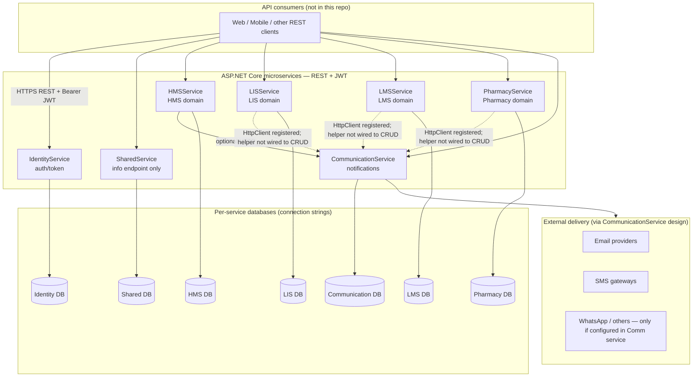
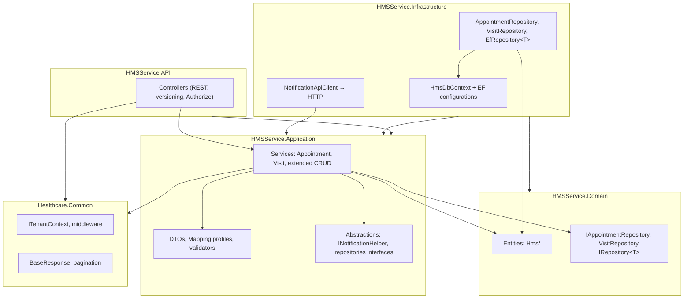
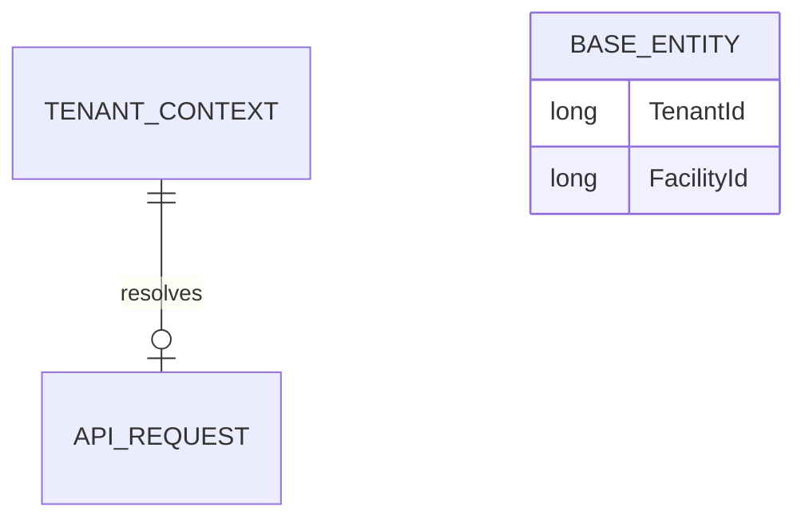
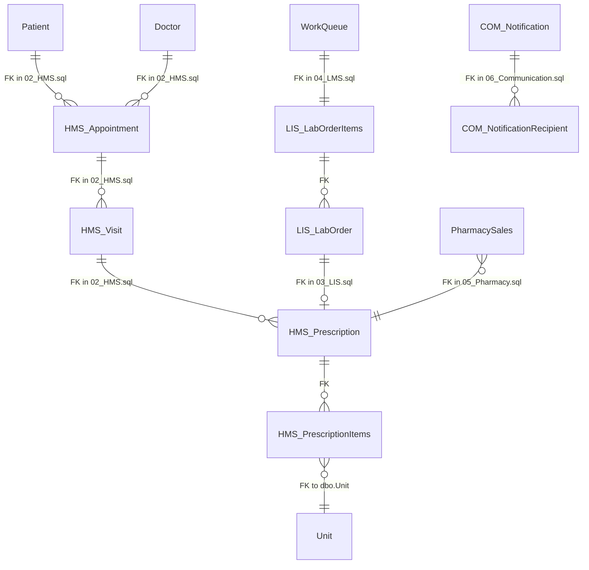
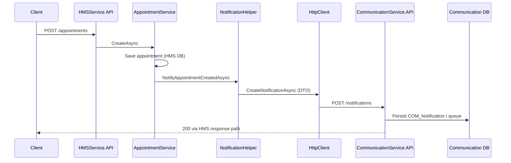

# HealthcarePlatform — Technical Architecture & Documentation

**Evidence scope:** `HealthcarePlatform/` backend solutions, `BuildingBlocks/Healthcare.Common`, SQL scripts at repository root (`TriVita/*.sql`).  
**Not in scope:** Frontend applications (no React/mobile code in this backend repo).  
**Rule:** Features listed are **implemented in code** unless explicitly labeled *schema-only (SQL)*.

---

## PART 1 — High-level architecture (Mermaid)

**Notes (implemented):**

- **Service-to-service:** Typed HTTP to CommunicationService using `INotificationApiClient` (`CommunicationService.Contracts`) from **HMSService** (`NotificationHelper` → `NotificationApiClient`) on **appointment create** only. LIS/LMS/Pharmacy register `HttpClient` + notification helpers but **no call sites** in generated CRUD paths were found.
- **SharedService:** `SharedDbContext` has **no `DbSet<>`**; only `InfoController` — **no Patient/Doctor/ReferenceData APIs** in this codebase.
- **External integrations:** Actual SMTP/SMS/WhatsApp dispatch is **inside CommunicationService** application/infrastructure (not duplicated in HMS/LIS/etc.).

---

## PART 2 — Clean architecture: HMSService (representative)

**Dependency rule:** API → Application → Domain; Infrastructure implements persistence and implements Application/Domain ports.

**Implemented flow:** Controllers depend on Application services; services use `IRepository<>` / dedicated repos, AutoMapper, optional FluentValidation, `ITenantContext`; `AppointmentService` calls `INotificationHelper` which uses `INotificationApiClient` (HTTP).

---

## PART 3 — Enterprise & shared domain

### 3.1 SQL scripts (data model definition)

| Script | Content (evidence from file headers / CREATE TABLE) |
|--------|------------------------------------------------------|
| `00_EnterpriseHierarchy_Root.sql` | `Address`, `ContactDetails`, `Enterprise`, `Company`, `BusinessUnit`, `Facility`, `Department`, etc. |
| `01_SharedDomain.sql` | `Unit`, `ReferenceDataDefinition`, `ReferenceDataValue`, `Doctor`, `Patient`, … |
| `06_Communication.sql` | `COM_Notification`, recipients, channels, templates, logs, queue |

### 3.2 SharedService (code)

- **`SharedDbContext`:** `OnModelCreating` applies configurations from assembly; **no entity `DbSet<>` declarations** in the context file.
- **API:** `SharedService.API/Controllers/v1/InfoController.cs` only (module metadata).
- **Conclusion:** Enterprise hierarchy and shared masters are **defined in SQL** for the platform; the **SharedService** microservice does **not** expose CRUD for Patient/Doctor/Unit/ReferenceData in the current code.

### 3.3 TenantId / FacilityId propagation (implemented)

- **`ITenantContext`** (`Healthcare.Common`): `TenantId`, `FacilityId`, `UserId`, `Roles` — resolved from JWT claims and/or headers `X-Tenant-Id`, `X-Facility-Id` (`HttpTenantContext`).
- **`RequireTenantContext` middleware:** API routes under `/api/` require non-zero `TenantId` (health/swagger excluded).
- **EF:** Each service `*DbContext` applies a **global query filter** on `BaseEntity`: `!IsDeleted && TenantId == TenantFilter`.
- **`SaveChanges`:** On insert, `TenantId` is set from context; **FacilityId** may be defaulted from context where the service’s rules allow (e.g. HMS excludes tenant-level catalogs).

**Cross-service “shared data reuse”:** Not implemented as HTTP calls to SharedService. Module entities store **foreign key IDs** (e.g. `PatientId`, `DoctorId`) as scalars; **referential integrity** is assumed via **shared SQL schema** in a monolith DB or via governance when DBs are split — **no SharedService API** enforces lookups in code.

---

## PART 4 — Module-wise documentation (strictly from code)

### MODULE: HMSService

| # | Item | Evidence |
|---|------|----------|
| **1. Purpose** | Hospital Management System APIs for scheduling, visits, clinical documentation, prescriptions, billing metadata. | Controllers + domain naming |
| **2. Implemented features** | CRUD + paged list for appointments & visits (with filters); extended CRUD for visit types, appointment status history, appointment queue, vitals, clinical notes, diagnoses, procedures, prescriptions/items/notes, payment modes, billing headers/items, payment transactions. **Appointment create** triggers `INotificationHelper.NotifyAppointmentCreatedAsync` (HTTP to CommunicationService when configured). | `HMSService.API/Controllers`, `AppointmentService.cs`, `NotificationHelper.cs` |
| **3. API endpoints** | Versioned routes under `api/v{version}/` e.g. `appointments`, `visits`, `visit-types`, `appointment-status-history`, `appointment-queue`, `vitals`, `clinical-notes`, `diagnoses`, `procedures`, `prescriptions`, `prescription-items`, `prescription-notes`, `payment-modes`, `billing-headers`, `billing-items`, `payment-transactions`. Standard pattern: GET by id, GET paged, POST, PUT, DELETE (soft delete). | Controller `[Route]` attributes |
| **4. Key services** | `AppointmentService`, `VisitService`, extended `*Service` + `HmsCrudServiceBase`, `NotificationHelper`. | `HMSService.Application/Services` |
| **5. Domain entities** | `HmsVisitType`, `HmsAppointment`, `HmsVisit`, … (16 entity files). | `HMSService.Domain/Entities` |
| **6. Database tables used** | Maps to `02_HMS.sql` tables via EF `ToTable` (e.g. `HMS_Appointment`, `HMS_Visit`, `HMS_Procedure`, …). | `Infrastructure/Persistence/Configurations` |
| **7. Relationships with other modules** | **CommunicationService:** HTTP notification on appointment create. **IdentityService:** JWT validation only (no direct HTTP to Identity from HMS in application code beyond auth). **Schema:** FKs in SQL to `Patient`, `Doctor`, `Department`, `ReferenceDataValue`, `Unit` — **IDs stored**; **no runtime SharedService integration.** | Code + SQL |

---

### MODULE: LISService

| # | Item | Evidence |
|---|------|----------|
| **1. Purpose** | Laboratory Information System — catalog, orders, samples, results, reports. | Controllers / entities |
| **2. Implemented features** | Per-entity CRUD + paged GET for all LIS tables generated into the solution. `InfoService` for module info. `LisNotificationHelper` exists with `NotifyLabReportReadyAsync` but is **not invoked** from generated LIS CRUD services (no references found outside helper/DI). | `LISService.Application`, `LISService.API/Controllers/v1/Entities` |
| **3. API endpoints** | e.g. `test-category`, `lab-order`, `sample-tracking`, … + `info`. | `[Route]` on controllers |
| **4. Key services** | Generated `Lis*Service` + `LisCrudServiceBase`; `InfoService`. | `Application/Services` |
| **5. Domain entities** | `LisTestCategory`, … `LisReportDetail` (15 entities). | `LISService.Domain/Entities` |
| **6. Database tables used** | `03_LIS.sql` tables via `LisDbContext` + configurations. | `LisDbContext`, `Configurations` |
| **7. Relationships with other modules** | **Schema (`03_LIS.sql`):** FKs to HMS prescription/visit items, etc. **Code:** scalar FK columns only; **no HTTP** to HMSService. Notification helper available but **not wired** to report completion in CRUD layer. | SQL + grep |

---

### MODULE: LMSService

| # | Item | Evidence |
|---|------|----------|
| **1. Purpose** | Lab Management System — processing stages, work queue, equipment, QC, inventory. | |
| **2. Implemented features** | Per-entity CRUD + paged GET for all LMS tables; `InfoService`. `HttpClient` + notification helper pattern registered; **no call sites** in generated CRUD for cross-service flows. | Same pattern as LIS |
| **3. API endpoints** | e.g. `processing-stage`, `work-queue`, `equipment`, `qc-record`, `lab-inventory`, … + `info`. | |
| **4. Key services** | `Lms*Service` + `LmsCrudServiceBase`; `InfoService`. | |
| **5. Domain entities** | 10 `Lms*` entities. | `LMSService.Domain/Entities` |
| **6. Database tables used** | `04_LMS.sql` tables. | `LmsDbContext` |
| **7. Relationships with other modules** | **Schema:** `WorkQueue` FK to `LIS_LabOrderItems` (cross-module). **Code:** scalar IDs; **no HTTP orchestration** between LIS and LMS. | SQL FKs + code |

---

### MODULE: PharmacyService

| # | Item | Evidence |
|---|------|----------|
| **1. Purpose** | Pharmacy catalog, batch stock, procurement, sales, adjustments, transfers, expiry. | |
| **2. Implemented features** | Per-entity CRUD + paged GET for 20 pharmacy tables; `InfoService`. Notification HTTP client registered; **no** prescription-to-pharmacy orchestration service beyond CRUD. | |
| **3. API endpoints** | e.g. `medicine-category`, `medicine`, `pharmacy-sale`, `stock-ledger`, … + `info`. | |
| **4. Key services** | `Phr*Service` + `PhrCrudServiceBase`; `InfoService`. | |
| **5. Domain entities** | 20 `Phr*` entities. | |
| **6. Database tables used** | `05_Pharmacy.sql` tables. | `PharmacyDbContext` |
| **7. Relationships with other modules** | **Schema:** FKs to `HMS_Prescription` / items. **Code:** stores IDs; **no HTTP** to HMS for prescription validation in codebase. | |

---

### MODULE: IdentityService (supporting)

- **Implemented:** `POST api/v{version}/auth/token`, `GET api/v{version}/auth/me` (`AuthController`).
- **Purpose:** Issue/consume JWTs used by other services (`Jwt` config per API).

### MODULE: CommunicationService (supporting)

- **Implemented:** `NotificationsController` — create notification, send-template, get by id, paged logs, templates list (`CommunicationService.API`).
- **Persistence:** `ComNotification`, `ComNotificationRecipient`, `ComNotificationChannel`, `ComNotificationTemplate`, `ComNotificationLog`, `ComNotificationQueue` (`CommunicationDbContext`).
- **Schema alignment:** `06_Communication.sql` defines `COM_*` tables (naming aligned with `Com*` entities in code).

### MODULE: SharedService (supporting)

- **Implemented:** Info/metadata endpoint only; **no** shared master CRUD in code (see Part 3).

---

## PART 5 — Entity relationship diagram (schema-informed, code entities)

**Legend:** Solid lines = FK in **SQL scripts** between tables. **Microservices** use **separate databases** in config; runtime cross-DB FK enforcement is not shown. Dashed = logical reference by ID in service code.

**Code reality:** HMSService entities do not expose EF navigation properties to `Patient`/`Doctor` tables (other services); **scalar IDs** match the SQL intent.

---

## PART 6 — Inter-service interaction (implemented flows only)

### 6.1 Appointment → notification (implemented)

**Note:** Notification may be **skipped** if `HmsNotifications` reference IDs are unset (`NotificationHelper` logs warning).

### 6.2 End-to-end “Patient journey” / Lab / Pharmacy chains

**Not implemented** as automated orchestration across services in code (no single saga/orchestrator found). Individual CRUD APIs exist per module; **composition is a client responsibility** unless added later.

---

## PART 7 — Data flow & multi-tenancy

| Mechanism | Implementation |
|-----------|----------------|
| **Tenant isolation** | JWT claim `tenant_id` and/or header `X-Tenant-Id` → `ITenantContext.TenantId`; EF global filter on all `BaseEntity` rows. |
| **Facility scope** | Header `X-Facility-Id` / claim `facility_id`; `FacilityId` on entities; some catalogs allow NULL `FacilityId` per service rules. |
| **API communication** | REST/JSON; **no** gRPC found in these services for inter-service calls. |
| **Data ownership** | Each service owns its **DbContext** and connection string; **no distributed transaction** across HMS/LIS/LMS/Pharmacy in code. |

---

## PART 8 — Communication & notification flow

| Aspect | Implemented behavior |
|--------|----------------------|
| **Trigger** | HMSService `AppointmentService` after successful appointment create → `NotificationHelper`. |
| **Transport** | `NotificationApiClient` POST to CommunicationService base URL (`Communication:BaseUrl`). |
| **CommunicationService** | `INotificationService` persists notifications, recipients, channels, **queue** (`ComNotificationQueue`), **logs** (`ComNotificationLog`); templates supported (`NotificationsController` actions). |
| **Channels (Email/SMS/WhatsApp)** | **Not** implemented inside HMS/LIS/LMS/Pharmacy; **CommunicationService** owns delivery pipeline (see CommunicationService.Application/Infrastructure — details omitted here unless file-scoped). |
| **Queue + processing** | **Entities/repositories** for `ComNotificationQueue` exist in CommunicationService; worker/processing **not verified** in this document without reading background hosts. |

---

## PART 9 — Diagram index

| Diagram | Location |
|---------|----------|
| High-level architecture | Part 1 |
| Clean architecture (HMS) | Part 2 |
| Tenant/base entity | Part 3 |
| Cross-module ER (SQL FKs) | Part 5 |
| Appointment → notification sequence | Part 6 |

---

## PART 10 — Quality & limitations

- **No frontend** in this repository — diagrams show generic API consumers.
- **Shared/enterprise CRUD** — **not** in SharedService code; documented as **SQL + gap**.
- **LIS/LMS/Pharmacy notification helpers** — **registered** but **not** called from generated CRUD services (grep verified for LIS).
- **Coverage:** For exhaustive endpoint lists, use Swagger or controller inventory per service.

---

*Generated for TriVita HealthcarePlatform backend — evidence-based.*
